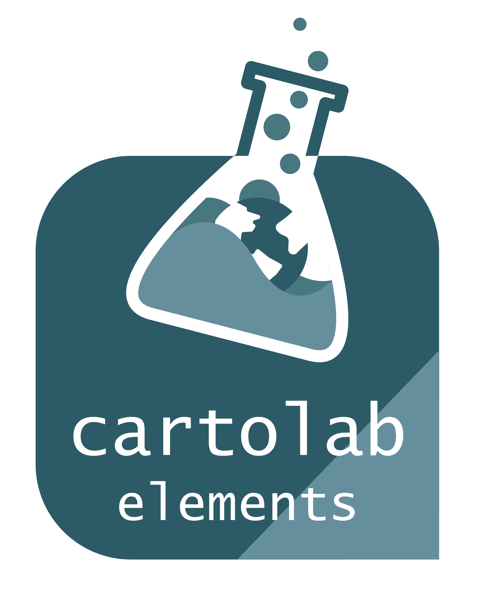

# CartoLab Elements



[Demo](https://cartolab-gis.github.io/elements/)

CartoLab Elements are a set of reusable and themeable React components for building user interfaces for map-based web applications. 

## Motivation

Similar to paper maps, digital maps generally include a common set of elements – things like zoom controls, basemap options, and a layer list. A set of reusable and themeable components enables developers to rapidly build map-based applications that match existing brands and frees up their time to focus more on the specific business logic of their applications.

This idea has been realized to a degree in tools like Esri’s Web AppBuilder – a platform that lets non-developers to configure “widgets” for mapping applications. CartoLab Elements are similar in concept to these “widgets”; however, they are different in that:

a)	They are primarily meant for developers, and  
b)	Unlike Esri’s widgets, which can only be used in specific application templates, CartoLab Elements will work in any React-based web application  

CartoLab Elements currently works with MapboxGL.js. We chose Mapbox because:

a)	It’s what we use most often at CartoLab in our daily work.  
b)	Compared to other mapping libraries, it has the fewest UI elements or plugins available.  


In the future we may consider expanding support beyond Mapbox to multiple mapping libraries.

## Comparison to other React mapping projects
Elements is different from libraries like [react-map-gl](https://uber.github.io/react-map-gl/#/) and [react-mapbox-gl](https://github.com/alex3165/react-mapbox-gl) in that it is not an attempt to port the MapboxGL API into React Components. Instead, it is our philosphy that MapboxGL should manage the map and its WebGL Context, while React simply manages all the other UI elements in an application that need to interact with a map. Working with Elements, you should be able to use MapboxGL.js directly or use one of these wrapper libraries (as long as you can pass in the map instance to Elements' Context).


## Usage
### Installation
`npm install @cartolab/elements`
or
`yarn add @cartolab/elements`

### Peer Dependencies 
In order to CartoLab Elements to work, your project must include the following packages:

* react
* react-dom
* mapbox-gl

### App Initialization
In the entry point/top level of your application, enable Elements by importing and wrapping the app in the `<ElementsProvider>`. The Elements Provider does two things:

a) It passes in theme information. See Theming section for more details.
b) It creates a shared map context so that the state of the map can be read and controlled by the components.

Example in the index.js file of an app created with Create React App:

``` javascript
import React from 'react';
import ReactDOM from 'react-dom';
import './index.css';
import { ElementsProvider } from '@cartolab/elements';
import defaultTheme from '@cartolab/elements/src/themes/defaultTheme';
import App from './App';

ReactDOM.render(
  <ElementsProvider theme={defaultTheme}>
    <App />
  </ElementsProvider>,
  document.getElementById('root')
);
```

Example App.js. Note how you can place CartoLab Elements as children or siblings of the Map component. Your choice may depend on how you want to position these components in your application. You can see more examples of usage in the source for our Storybook app and in the tests.

``` javascript
import React from 'react'
import {Map, Zoom, BasemapSwitcher} from @cartolab/elements

const App = () => {
  return (
    <div>
      <Map mapOptions={  
        container: 'map',
        style: 'mapbox://styles/mapbox/streets-v11',
        center: [-95.7742, 29.80814],
        zoom: 10,
        accessToken: /* use your own Mapbox Token if needed */
      }>
        <Zoom>
        <BasemapSwitcher>
      </Map>
      <LayerList           
        panel={false}
        layers={[
          {
            layerIds: ['water', 'water-shadow'], //fill
            layerName: 'Water'
          },
          {
            layerIds: ['road-motorway-trunk'], //line
            layerName: 'Motorway'
          }
        ]}
      />
    </div>
  )};
}
```


## Theming
CartoLab Elements are built with [Rebass](https://rebassjs.org/), which uses [Styled System](https://styled-system.com/) and the [System UI Theme Specification](https://system-ui.com/theme). This means that you can use any theme made for Rebass, Styled System, Theme-UI, or any other compliant theme with CartoLab Elements. 

We've provided a default theme to help you get started quickly. 

### Overriding Themes
CartoLab Elements are extensions of Rebass elements, and therefore the `css` prop from Styled System and Emotion can be used in any component to override theme values. In general, it is preferrable to set styles in a theme file and create variants for different presentation options. The `css` prop override shuld be used sparingly or only for positioning of elements.

## Component Playground and Docs
You can explore CartoLab Elements in our interactive playground, built with [Storybook](https://storybook.js.org/). We've included documentation, code examples, and interactive exploration of various props and theming options.

To run the storybook application, clone and run: `yarn dev`

## Roadmap
We have many ideas for enhancing CartoLab Elements over time. Some possibilities include:

* Adding more components
* Expanding support to other mapping APIs, like Leaflet and OpenLayers
* Providing non-React versions (Vue, Vanilla JS, etc.)

## Contributing 

To contribute to this project please fork and merge all PRs from the `develop` branch. We use a modified version of GitFlow where the `master` branch represents a stable release and `develop` represents a set of features in progress for a future release.

To run in development mode, install and run `yarn dev`. This will launch a development version of Storybook to create a development environment. Running `yarn test` will run tests against the code. We use Jest and React Testing Library for testing these components.


If you have an idea, question, or issue please open an issue and let us know. 